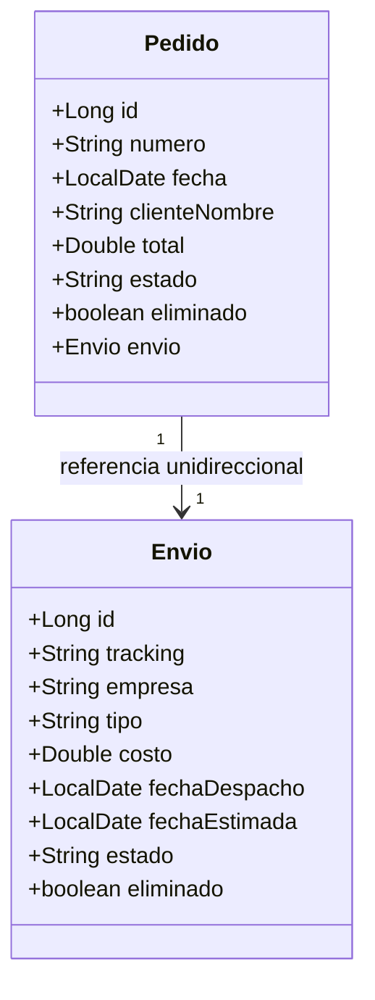

# 🚀 TPI Programación 2 - Sistema de Gestión de Pedidos y Envíos

[](https://www.oracle.com/java/)
[](https://www.mysql.com/)
[](LICENSE)
[](https://docs.oracle.com/javase/tutorial/jdbc/)

## 📋 Descripción

Sistema de gestión de pedidos y envíos desarrollado en Java con arquitectura en capas, implementando una relación **1→1 unidireccional** entre Pedido y Envío. El proyecto utiliza JDBC puro para la persistencia de datos y manejo de transacciones.

### ✨ Características Principales

- ✅ **Arquitectura en Capas**: Separación clara entre entities, DAO, service y presentación
- ✅ **Transacciones ACID**: Manejo completo de transacciones con commit/rollback
- ✅ **Eliminación Lógica**: Soft delete para mantener integridad de datos
- ✅ **Relación 1→1**: Implementación de relación unidireccional con Foreign Key UNIQUE
- ✅ **CRUD Completo**: Operaciones Create, Read, Update, Delete para ambas entidades
- ✅ **Demo de Rollback**: Demostración práctica del manejo de transacciones

---

## 🏗️ Arquitectura del Sistema

```
src/
├── config/
│   └── DatabaseConnection.java      # Configuración de conexión a BD
├── entities/
│   ├── Pedido.java                  # Entidad Pedido (A)
│   └── Envio.java                   # Entidad Envío (B)
├── dao/
│   ├── PedidoDAO.java               # Interfaz DAO Pedido
│   ├── EnvioDAO.java                # Interfaz DAO Envío
│   └── impl/
│       ├── PedidoDAOImpl.java       # Implementación DAO Pedido
│       └── EnvioDAOImpl.java        # Implementación DAO Envío
├── service/
│   ├── PedidoService.java           # Interfaz Service
│   └── impl/
│       └── PedidoServiceImpl.java   # Implementación Service (Transacciones)
└── main/
    └── AppMenu.java                 # Interfaz de usuario (Menú consola)
```

### 📊 Diagrama de Clases



### 🗄️ Modelo de Base de Datos

```sql
-- Relación 1→1 Unidireccional
pedido.id_envio → envio.id (FK UNIQUE)
```

**Restricciones:**
- `pedido.id_envio` es UNIQUE para garantizar 1→1
- Foreign Key con ON DELETE NO ACTION, ON UPDATE CASCADE
- Eliminación lógica mediante campo `eliminado`

---

## 🛠️ Tecnologías Utilizadas

| Tecnología | Versión | Propósito |
|------------|---------|-----------|
| Java | 21 | Lenguaje principal |
| MySQL | 8.0 | Base de datos relacional |
| JDBC | 8.3.0 | Conectividad con base de datos |


## 📦 Requisitos Previos

- ☕ **JDK 21** o superior
- 🐬 **MySQL 8.0** o superior
- 📚 **MySQL Connector/J 8.3.0** (incluido en `/lib`)
- 💻 **IDE recomendado**: IntelliJ IDEA, Eclipse, o VSCode

---

## 🚀 Instalación y Configuración

### 1️⃣ Clonar el Repositorio

```bash
git clone https://github.com/tu-usuario/tpi-prog2-pedido-envio.git
cd tpi-prog2-pedido-envio
```

### 2️⃣ Configurar Base de Datos

**Opción A: MySQL**
```bash
mysql -u root -p < database.sql
mysql -u root -p < data.sql
```

**Opción B: SQL Server**
```bash
sqlcmd -S localhost -U sa -P tu_password -i database.sql
sqlcmd -S localhost -U sa -P tu_password -i data.sql
```

### 3️⃣ Configurar Credenciales

Editar `src/config/DatabaseConnection.java`:

```java
private static final String URL  = "jdbc:mysql://localhost:3306/tpi_prog2_pedido_envio?useSSL=false&serverTimezone=UTC";
private static final String USER = "root";
private static final String PASS = "tu_password";
```

### 4️⃣ Compilar y Ejecutar

**En Windows:**
```bash
run_tpi.bat
```

**En Linux/Mac:**
```bash
# Compilar
javac -d out -cp "lib/mysql-connector-j-8.3.0.jar" src/**/*.java

# Ejecutar
java -cp "out:lib/mysql-connector-j-8.3.0.jar" main.AppMenu
```

---

## 📱 Uso del Sistema

### Menú Principal

```
==== MENÚ PEDIDO → ENVÍO ====
1) Crear Pedido + Envio (transacción)
2) Listar Pedidos
3) Buscar Pedido por ID
4) Actualizar Pedido
5) Eliminar (lógico) Pedido
6) DEMO ROLLBACK (violar UNIQUE de id_envio)
0) Salir
```

### Ejemplos de Uso

#### 🆕 Crear Pedido Completo

```
-- Datos Envio --
Tracking: TRK-2025
Empresa: ANDREANI
Tipo: EXPRES
Costo: 2500.00
Fecha Despacho: 2025-11-15
Fecha Estimada: 2025-11-17
Estado: EN_PREPARACION

-- Datos Pedido --
Número: PED-2025
Fecha: 2025-11-15
Cliente Nombre: Juan Pérez
Total: 45000.00
Estado: NUEVO

✓ Transacción OK: Pedido PED-2025 creado con Envio ID 3
```

#### 📋 Listar Pedidos

```
Pedido{id=1, numero='PED-1001', fecha=2025-11-10, clienteNombre='Cliente Uno', total=25000.0, estado='NUEVO', envioId=1, eliminado=false}
Pedido{id=2, numero='PED-2025', fecha=2025-11-15, clienteNombre='Juan Pérez', total=45000.0, estado='NUEVO', envioId=3, eliminado=false}
```

---

## 🔄 Manejo de Transacciones

### Flujo de Transacción Exitosa

```java
Connection conn = DatabaseConnection.getConnection();
conn.setAutoCommit(false); // Iniciar transacción

try {
    // 1. Crear Envío
    Integer idEnvio = envioDAO.crear(envio, conn);
    
    // 2. Asociar Envío al Pedido
    pedido.setEnvio(envio);
    
    // 3. Crear Pedido
    Integer idPedido = pedidoDAO.crear(pedido, conn);
    
    conn.commit(); // ✅ Confirmar transacción
} catch (Exception e) {
    conn.rollback(); // ❌ Revertir cambios
    throw e;
}
```

### Demo de Rollback

La opción 6 del menú demuestra el rollback al intentar:
1. Crear un pedido válido con su envío
2. Intentar crear otro pedido reutilizando el mismo tracking (viola UNIQUE)
3. El sistema ejecuta automáticamente rollback

---

## 🧪 Testing

### Verificar Rollback

```sql
USE tpi_prog2_pedido_envio;

-- Ver pedidos de prueba
SELECT * FROM pedido WHERE numero LIKE 'PED-ROLL-%';

-- Ver envíos de prueba
SELECT * FROM envio WHERE tracking LIKE 'TRK-ROLL-%';
```

### Datos de Prueba

El archivo `data.sql` incluye:
- 2 envíos pre-cargados
- 1 pedido asociado al primer envío

---

## 📂 Estructura de Archivos

```
tpi-prog2-pedido-envio/
├── src/                          # Código fuente
├── lib/                          # Librerías (JDBC Driver)
│   └── mysql-connector-j-8.3.0.jar
├── out/                          # Archivos compilados
├── docs/                         # Documentación adicional
│   └── diagrama-completo.puml   # Diagrama UML PlantUML
├── database.sql                  # Script creación BD
├── data.sql                      # Datos de prueba
├── rollback.sql                  # Script verificación rollback
├── run_tpi.bat                   # Script ejecución Windows
├── README.md                     # Este archivo
└── LICENSE                       # Licencia MIT
```

---

## 🎯 Características Técnicas

### Capa de Entidades
- POJOs con constructores completos y vacíos
- Getters y Setters
- toString() sin recursión (evita StackOverflow)
- Relación 1→1 unidireccional

### Capa DAO
- Interfaces segregadas por entidad
- Implementaciones con PreparedStatement
- Manejo de ResultSet con try-with-resources
- Patrón DAO con Connection injection

### Capa Service
- Lógica de negocio encapsulada
- Manejo de transacciones
- Validaciones de negocio
- Propagación de excepciones

### Capa Main
- Menú interactivo de consola
- Manejo robusto de excepciones
- Validación de entrada del usuario

---

## 🔒 Seguridad

- ✅ Uso de PreparedStatement (previene SQL Injection)
- ✅ Eliminación lógica (preserva integridad referencial)
- ✅ Manejo de excepciones con rollback automático
- ✅ Validación de datos en capa Service

---

## 🤝 Contribuciones

Las contribuciones son bienvenidas. Para contribuir:

1. Fork el proyecto
2. Crea una rama para tu feature (`git checkout -b feature/AmazingFeature`)
3. Commit tus cambios (`git commit -m 'Add some AmazingFeature'`)
4. Push a la rama (`git push origin feature/AmazingFeature`)
5. Abrir un Pull Request


## 📄 Licencia

Este proyecto está bajo la Licencia MIT - ver el archivo [LICENSE](LICENSE) para más detalles.

---


<p align="center">
  <sub>⭐ Si este proyecto te fue útil, considera darle una estrella</sub>
</p>
